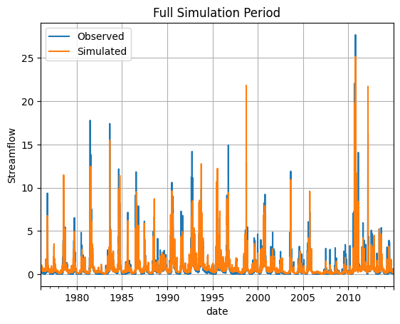
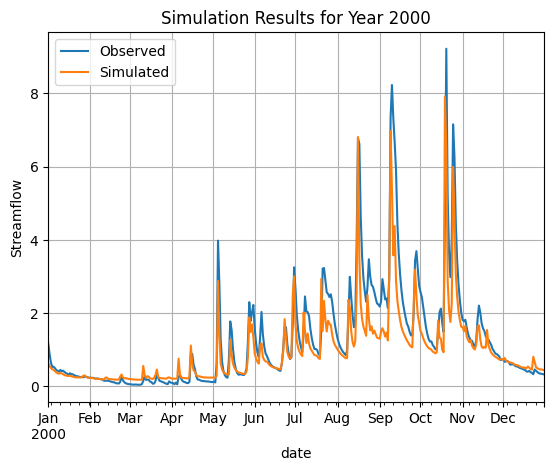

# Hydrological Simulation Workflow

This notebook demonstrates how to run hydrological simulations using the prediction workflow from the hydroml package.

The hydroml package contains several workflow modules that provide wrapper functions for different tasks. Here we focus on the prediction workflow, which allows us to:

1. Load a trained model
2. Provide input data (dynamic and static features)
3. Generate streamflow predictions

The key function we'll use is `run_hydrological_simulation()` which handles the entire prediction pipeline.


```python
# imports
%load_ext autoreload 
%autoreload 2

import pandas as pd
import matplotlib.pyplot as plt
from pathlib import Path
from hydroml.utils import helpers as h
from hydroml.workflow.prediction import run_hydrological_simulation

```

    The autoreload extension is already loaded. To reload it, use:
      %reload_ext autoreload


# Loading Sample Data

For this example, we'll use:

1. A pre-trained model from a specific path
2. Sample dynamic data (time series of precipitation and evapotranspiration) for catchment 401208
3. Static catchment attributes (like area, slope etc.) for the same catchment

The sample data is stored in CSV and JSON format in the `sample_data` directory.


```python
# For this example we need a trained model.
model_path = Path('../sample_data/model/version_0')
catchment_id = '401208'
dynamic_data=pd.read_csv(f'../sample_data/{catchment_id}.csv', index_col=0, parse_dates=True)
static_data=h.read_json(f'../sample_data/{catchment_id}_attributes.json')

```

# Running the Simulation

Now that we have loaded our data and model, we can run the hydrological simulation. The `run_hydrological_simulation()` function takes:

- The path to the trained model
- Dynamic input data (precipitation and evapotranspiration time series)  
- Static catchment attributes
- Catchment ID
- Additional parameters like device specification

The function returns an xarray Dataset containing the simulation results, including both predictions and observed values (if available).

Note:As the model might be calibrated on another system with gpu, we need to specify the device to run the simulation on cpu.


```python
# Run the simulation
simulation = run_hydrological_simulation(model_path, dynamic_data, static_data, catchment_id, device='cpu')
```

    Transforming data: loading transform parameters from ..\sample_data\model\params.yaml


    c:\Users\sho108\AppData\Local\pypoetry\Cache\virtualenvs\hydroml-dFLAodHf-py3.11\Lib\site-packages\torch\utils\data\dataloader.py:617: UserWarning: This DataLoader will create 12 worker processes in total. Our suggested max number of worker in current system is 10 (`cpuset` is not taken into account), which is smaller than what this DataLoader is going to create. Please be aware that excessive worker creation might get DataLoader running slow or even freeze, lower the worker number to avoid potential slowness/freeze if necessary.
      warnings.warn(


# Visualizing the Results
#
Now we'll visualize the simulation results in two ways:
1. A plot of the full simulation period to see the overall performance
2. A detailed view of a single year (2000) to better examine the model's ability to capture seasonal patterns

We'll also calculate some key performance metrics like NSE (Nash-Sutcliffe Efficiency) and KGE (Kling-Gupta Efficiency) 
to quantitatively evaluate the model's performance.


```python
# Convert simulation results to a pandas DataFrame for easier plotting
df = (simulation
      .sel(catchment_id=catchment_id)  # Select the specific catchment
      .to_dataframe()
      .reset_index()
      .set_index('date')
      .drop(columns=['catchment_id', 'lead_time', 'feature']))

# Rename columns to be more descriptive
df.columns = ['observed', 'simulated'] 

# Plot the full simulation period
plt.figure(figsize=(12, 6))
df.plot()
plt.title('Full Simulation Period')
plt.ylabel('Streamflow')
plt.legend(['Observed', 'Simulated'])
plt.grid(True)

# Plot a single year (2000) to see more detail
plt.figure(figsize=(12, 6))
df.loc[df.index.year == 2000].plot()
plt.title('Simulation Results for Year 2000')
plt.ylabel('Streamflow')
plt.legend(['Observed', 'Simulated'])
plt.grid(True)

```


    <Figure size 1200x600 with 0 Axes>


    

    


    <Figure size 1200x600 with 0 Axes>


    

    


```python
from hydroml.evaluation.metrics import Metrics   
Metrics(simulation['y'], simulation['prediction']).all_metrics().to_dataframe()

```


<div>
<style scoped>
    .dataframe tbody tr th:only-of-type {
        vertical-align: middle;
    }

    .dataframe tbody tr th {
        vertical-align: top;
    }

    .dataframe thead th {
        text-align: right;
    }
</style>
<table border="1" class="dataframe">
  <thead>
    <tr style="text-align: right;">
      <th></th>
      <th></th>
      <th></th>
      <th>nse</th>
      <th>kge</th>
      <th>rmse</th>
      <th>bias</th>
      <th>relative_bias</th>
      <th>absolute_bias</th>
      <th>nse_sqrt</th>
    </tr>
    <tr>
      <th>catchment_id</th>
      <th>lead_time</th>
      <th>feature</th>
      <th></th>
      <th></th>
      <th></th>
      <th></th>
      <th></th>
      <th></th>
      <th></th>
    </tr>
  </thead>
  <tbody>
    <tr>
      <th>401208</th>
      <th>0</th>
      <th>0</th>
      <td>0.585562</td>
      <td>0.616741</td>
      <td>0.583952</td>
      <td>1.107247</td>
      <td>0.107247</td>
      <td>1.107247</td>
      <td>0.579135</td>
    </tr>
  </tbody>
</table>
</div>


```python

```
