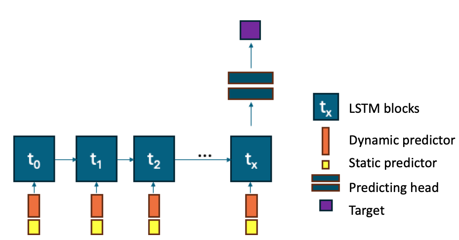

# Model Structure

The LSTM model architecture in HydroML is inspired by Kratzert et al. (2019). It incorporates key components of LSTM networks: Input gate, Forget gate, Cell state, and Output gate. These elements enable the model to regulate the flow of information and maintain long-term dependencies, making it particularly suitable for time series forecasting.



This model is designed to predict streamflow at the catchment scale and has been trained on the CAMELS-AUS dataset, which encompasses 222 catchments across Australia.

To ensure applicability in ungauged catchments, the model is trained continentally, enabling generalization across diverse regions. For gauged catchments, the approach involves first training the model continentally and then fine-tuning it for each specific catchment. Our experiments indicate that this approach yields superior performance, even for gauged catchments, as it leverages knowledge from the continental-scale training. These findings align with results from Kratzert et al. (2019). A detailed explanation of the experiments on the model perfromance is documented in a paper which will be published soon.

# Components of the Model Architecture
The HydroLSTM model consists of the following components:

1. **Dynamic Feature Embedding:**
   - Maps dynamic input features (e.g., meteorological time series) to a latent space.
   - Two variations of the model architecture are implemented:
     - **LSTM with only climate dynamic features:** This setup models hydrological processes directly, acting as a hydrological model.
     - **LSTM with climate and AWRA-L runoff dynamic features:** In this configuration, the model functions as a postprocessor for AWRA-L runoff. AWRA-L is a hydrological model that simulates runoff at the catchment scale, with data available via [Australia Water Outlook](https://awo.bom.gov.au/).
   - Employs a linear layer followed by optional dropout for regularization.
   - The size of the dynamic feature latent space is user-configurable.

2. **Static Feature Embedding:**
   - The model accepts static predictor by repeating same feature for all timesteps. The static feature is processed using a linear layer.
   - The size of static feature in the latent space is configurable by the user.

3. **LSTM Layers:**
   - Core of the model that captures temporal dependencies in the data.
   - Configurable number of layers and hidden units, allowing flexibility based on the dataset size and complexity.

4. **Fully Connected Output Layers:**
   - A feedforward network processes the output from the LSTM layers.
   - Produces predictions for the target variables (e.g., streamflow).


# List of Pre-trained Models

HydroLSTM includes several pre-trained models designed for different evaluation and operational purposes. These models vary in their training strategies and use cases:

## 1. **Simple Temporal Out-of-Sample Evaluation**
   - **Training Period**: 1991–2014  
   - **Validation Period**: 1975–1991  
   - **Training Strategy**:  
     - The model was first trained continentally using the training dataset.  
     - Fine-tuning was then performed for each catchment using only the training data from that specific catchment.  
   - **Outcome**:  
     - One continental model trained across all catchments.  
     - 222 fine-tuned models, one for each catchment.

## 2. **Temporal Cross-Validation**
   - **Data Splits**: The dataset was divided into 4 temporal folds:  
     - **Fold 0**: 1975–1985  
     - **Fold 1**: 1985–1995  
     - **Fold 2**: 1995–2005  
     - **Fold 3**: 2005–2015  
   - **Training Strategy**:  
     - The model was trained on 3 folds and evaluated on the remaining fold in a rotating manner.  
     - For each fold, fine-tuning was performed per catchment using only the training data for that specific catchment.  
   - **Outcome**:  
     - 4 continental models, one for each fold.  
     - 222 fine-tuned models per fold, resulting in 888 fine-tuned models in total.

## 3. **Model Trained on Complete Dataset (1975–2014)**
   - **Training Period**: 1975–2014  
   - **Strategy**:  
     - A single model was trained on all available data across all 222 catchments.  
     - Fine-tuning was then performed for each catchment individually.  
   - **Use Case**:  
     - **Operational Recommendation**:  
       - Use the fine-tuned model for a catchment when good-quality climate and streamflow data are available.  
       - If fine-tuning data is unavailable for a specific catchment, the continental model can be directly applied.  

## 4. **Additional Notes**:  
- The model’s fine-tuning process is flexible and can incorporate new catchments with sufficient data.
- [Example notebook for fine-tuning](examples/notebooks/finetuning.ipynb).  
- [Example notebook for training the continental model](examples/notebooks/run_evaluation.ipynb).

# Model Architecture Details

The model employs a combined embedding approach for static and dynamic features. Static features are embedded into a latent representation, which is then repeated to match the sequence length of dynamic features. These are merged and passed through LSTM layers. Dropout is applied at multiple stages to mitigate overfitting, followed by a fully connected head to generate the final predictions.

Key characteristics include:
- The ability to freeze and unfreeze layers for transfer learning.
- A custom loss function defined using `get_loss_fn`. A number of diferent loss functions are implemented, the default loss function is the Nash-Sutcliffe Efficiency (NSE) loss. A detailed explanation of the loss functions is explained in the [Loss Functions](docs/models.md#loss-functions) section.
- Configurable learning rate scheduler to adjust learning dynamics during training.

## Methods

The HydroLSTM class includes the following methods:

1. **`forward`**: Performs a forward pass through the model.
2. **`loss`**: Computes the loss for a given batch of data.
3. **`training_step`**: Defines the training step logic.
4. **`validation_step`**: Defines the validation step logic.
5. **`predict_step`**: Implements the prediction logic for inference.
6. **`configure_optimizers`**: Configures the optimizer and learning rate scheduler.
7. **`freeze_layers`**: Freezes specified layers of the model.
8. **`unfreeze_layers`**: Unfreezes specified layers of the model.
9. **`freeze_all_layers`**: Freezes all layers of the model.
10. **`unfreeze_all_layers`**: Unfreezes all layers of the model.
11. **`_reset_parameters`**: Resets the parameters of the LSTM model.
12. **`merge_static_dynamic`**: Merges static and dynamic features into a unified representation.
13. **`get_forget_bias`**: Retrieves the forget gate bias of the LSTM layers.

## Custom Models
To implement a custom model:

1. Create a new model class inheriting from `pl.LightningModule`.
2. Implement the required methods such as `forward`, `training_step`, `validation_step`, and `configure_optimizers`.
3. Register the model in `hydroml.models` to enable streamlined integration.


# Loss Functions

The HydroLSTM model supports multiple custom loss functions, enabling flexibility based on the modeling goals. These loss functions are defined in the `get_loss_fn` utility function, which selects the appropriate loss function based on the configuration.

## 1. Mean Squared Error (MSE) Loss
The MSE loss computes the mean of the squared differences between predictions and ground truth values. It is defined as:

\[
\text{MSE Loss} = \frac{1}{N} \sum_{i=1}^{N} (y_i - \hat{y}_i)^2
\]

**Implementation:**
```python
from typing import Dict, Any
import torch

def mse_loss(prediction: torch.Tensor, ground_truth: torch.Tensor, metadata: Dict[str, Any]) -> torch.Tensor:
    observed_variance = metadata['observed_variance'].unsqueeze(1).unsqueeze(1)
    weight = metadata.get('weight', torch.ones_like(observed_variance)).unsqueeze(1).unsqueeze(1)

    mask = ~torch.isnan(ground_truth)
    masked_prediction = prediction[mask]
    masked_ground_truth = ground_truth[mask]
    masked_weight = weight[mask]

    loss = masked_weight * (masked_prediction - masked_ground_truth) ** 2
    return torch.mean(loss)
```

## 2. Nash-Sutcliffe Efficiency (NSE) Loss
NSE is widely used in hydrology to evaluate the predictive accuracy of models. It measures the variance of the prediction errors relative to the variance of the observations.

\[
\text{NSE Loss} = 1 - \frac{\sum_{i=1}^N (y_i - \hat{y}_i)^2}{\sum_{i=1}^N (y_i - \bar{y})^2}
\]

**Implementation:**
```python
def nse_loss(prediction: torch.Tensor, ground_truth: torch.Tensor, metadata: Dict[str, Any]) -> torch.Tensor:
    observed_variance = metadata['observed_target_std']
    weight = metadata.get('weight', torch.ones_like(observed_variance))

    observed_variance = observed_variance.unsqueeze(1).repeat(1, prediction.size(1), 1)
    if len(weight.shape) == 1:
        weight = weight.unsqueeze(1).unsqueeze(1)
    elif len(weight.shape) == 2:
        weight = weight.unsqueeze(1)
    else:
        raise ValueError(f"Weight shape {weight.shape} is not supported")

    weight = weight.repeat(1, prediction.size(1), 1)
    mask = ~torch.isnan(ground_truth) 
    masked_prediction = prediction[mask] 
    masked_ground_truth = ground_truth[mask]   
    masked_observed_variance = observed_variance[mask]
    masked_weight = weight[mask]

    squared_error = (masked_prediction - masked_ground_truth) ** 2 
    scaled_loss = masked_weight / (masked_observed_variance + 1) * squared_error
    adjusted_loss = torch.where(scaled_loss > 1000, 1000 + (1000 - scaled_loss) * 0.1, scaled_loss)
    return torch.mean(adjusted_loss)
```

## 3. Loss Function Selector
The `get_loss_fn` function determines which loss function to use based on the model configuration.

**Implementation:**
```python
from hydroml.config.config import Config
import torch.nn as nn

def get_loss_fn(config: Config) -> nn.Module:
    if config.loss_fn == 'mse':
        return mse_loss
    elif config.loss_fn == 'nse':
        return nse_loss
    else:
        raise ValueError(f"Loss function {config.loss_fn} not supported")
```


---
# References

Kratzert, F., Klotz, D., Shalev, G., Klambauer, G., Hochreiter, S., & Nearing, G. (2019). Towards learning universal, regional, and local hydrological behaviors via machine learning applied to large-sample datasets. *Hydrology and Earth System Sciences, 23*(12), 5089-5110.

